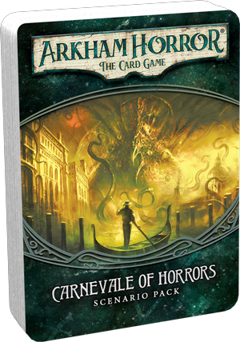

Carnevale of Horrors
=====================

이 문서는 아캄 호러: 카드게임의 싱글 시나리오인 *공포의 카니발* 의 이야기 부분과 시나리오의 도입/결론, 시나리오에 사용되는 액트/아젠다 카드의 이야기 부분에 대한 번역을 담고 있습니다.

# 주의

이 시나리오의 도입/Act/Agenda/결론을 읽게 되면 시나리오 내용만이 아니라 게임의 진행에 대한 내용 누설이 있을 수 있습니다.
